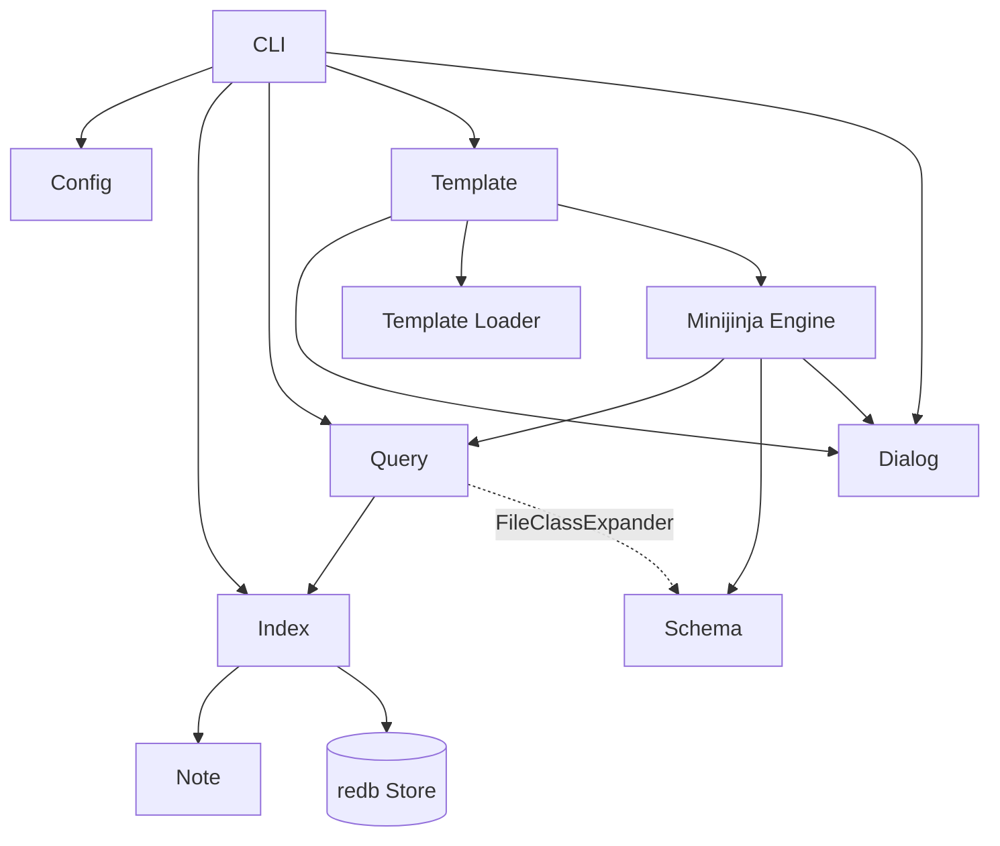

# Context Map

Traces is a CLI tool for template-driven personal knowledge management.
Each module under `src/` has its own `CONTEXT.md` defining the glossary,
domain terms, and seams for that area.

## Contexts

- [Core](./src/CONTEXT.md) — Shared domain primitives, security boundaries,
  and cross-cutting types (`src/`)
- [CLI](./src/cli/CONTEXT.md) — Command-line interface, argument routing, and
  diagnostic mapping (`src/cli/`)
- [Config](./src/config/CONTEXT.md) — Discovery, TOML parsing, workspace trust
  verification, and config tracking (`src/config/`)
- [Dialog](./src/dialog/CONTEXT.md) — Object-safe interactive and automated
  user prompt seam (`src/dialog/`)
- [Index](./src/index/CONTEXT.md) — Persistent file index, redb storage, and
  derived inbound link graph (`src/index/`)
- [Note](./src/note/CONTEXT.md) — Markdown note AST parsing, YAML frontmatter,
  inline fields, links, and tasks (`src/note/`)
- [Query](./src/query/CONTEXT.md) — Source selection DSL, row projection, and
  memoized result-set transformations (`src/query/`)
- [Schema](./src/schema/CONTEXT.md) — Schema registry, field resolution,
  inheritance DAG, and class hierarchy (`src/schema/`)
- [Template](./src/template/CONTEXT.md) — Template resolution, minijinja engine
  namespaces, and root-confined file writing (`src/template/`)

## Relationships & Seams

- **CLI → Subsystems**: `CLI` acts as the process composition root, delegating
  to `ConfigService`, `IndexerService`, `QueryService`, `TemplateService`,
  and `DialogProvider`.
- **Dialog Seam**: `DialogProvider` provides an object-safe I/O boundary
  consumed by `TemplateEngine` (`ui.*`) and `CLI` (`init`), satisfied by
  `TerminalDialogProvider` (TTY) or `PresetDialogProvider` (headless / tests).
- **Index & Note**: `Index` scans files into `FileBase` and delegates markdown
  content parsing to `Note`.
- **Query & Schema (Decoupled)**: `Query` evaluates source expressions against
  `FileIndex` and expands `@Class*` hierarchies via the `FileClassExpander`
  seam without direct dependency on `Schema`.
- **Template Composition**: `Template` registers `query`, `tasks`, `schema`,
  `ui`, `file`, and `date` helpers into the minijinja runtime and enforces
  root confinement during output writing.

## Reading order

When exploring a topic, read the context that owns the concept first, then
cross-reference related contexts as needed. The root `docs/adr/` holds
system-wide architecture decisions; individual contexts may also have
`docs/adr/` for context-specific decisions.
